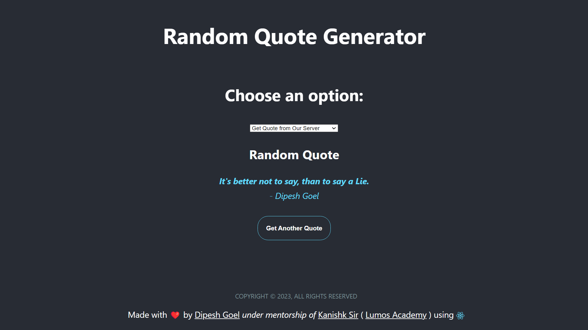

# Random Quote Generator



## Overview

This is a full-stack web application that allows users to generate and display random quotes. Users can choose from three options: 

1. Enter Quote: Users can enter a custom quote and author to add it to the database.
2. Get Quote from Our Server: Users can fetch a random quote from our own server, which stores a collection of quotes in a MongoDB database.
3. Get Quote from Third-Party API: Users can fetch a random quote from a third-party API (https://api.quotable.io/random).

The project uses a React.js frontend for the user interface and an Express.js backend to handle API requests and interact with the MongoDB database.

## Features

- Random Quote Generator: Fetch a random quote from either the local database or a third-party API.
- Add Custom Quote: Enter a custom quote and author to add it to the database.
- Dynamic Button Text: The "Get Quote" button changes to "Get Another Quote" once a quote is fetched, allowing users to fetch more quotes without refreshing the page.
- Responsive Design: The user interface is designed to work on various screen sizes, including mobile devices and tablets.
- Error Handling: Proper error handling is implemented for API requests and database operations.

## Installation and Setup

1. Clone the repository:

```bash
git clone https://github.com/DIPESHGOEL27/Random-Quote.git
```

2. Install dependencies for both the frontend and backend:

```bash
cd ../frontend
npm install

cd ../backend
npm install
```

3. Create a MongoDB Atlas account and set up a cluster. Replace the MongoDB connection string in `backend/server.js` with your own connection string.

4. Start the frontend and backend servers:

```bash
cd ../frontend
npm start

cd ../backend
npm start
```

5. Open the web application in your browser at `http://localhost:3000`.

## Technologies Used

- React.js
- Express.js
- MongoDB
- Axios

## Credits

The project uses the [Quotable API](https://api.quotable.io) to fetch random quotes.

## License

This project is licensed under the MIT License - see the [LICENSE](LICENSE) file for details.

---
